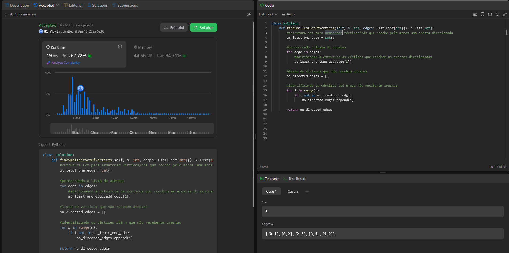

# 1557. Minimum Number of Vértices to Reach All Nodes

O arquivo [LC1157.py](./LC1557.py) apresenta a resolução do exercício número 1557 sobre grafos da plataforma LeetCode.

A resolução foi aceita pela plataforma, conforme a **Figura 1** abaixo:

<center>



**Figura 1** - Resolução da questão 1557.

</center>


## Explicação da solução
1. Cria-se uma estrutura set para armazenar os vértices/nós que recebem pelo menos uma aresta direcionada. ```at_least_one_edge = set()```.

2. Percorre-se a lista de grafos recebida (for edge in edges:), adicionando a estrutura os vértices que recebem as arestas direcionadas ```at_least_one_edge.add(edge[1])```.

3. Cria-se uma lista para os vértices que não recebem arestas.  ```no_directed_edges = []```

4. De acordo com o número de n de vértices recebidos na função, identifica-se os vértices que não receberam arestas e os armazena. E esta é a saída ```return no_directed_edges```.
