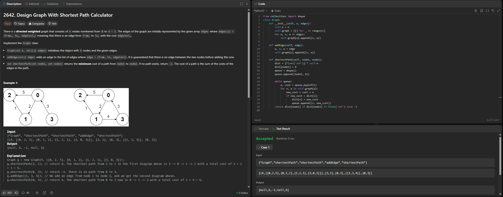

# 2642. Design Graph With Shortest Path Calculator

O arquivo [LC2642.py](./LC2642.py) apresenta a resolução do exercício número 2642 sobre grafos da plataforma LeetCode.

A resolução foi aceita pela plataforma, conforme a **Figura 1** abaixo:

**Figura 1** - Resolução da questão 2642.

## Explicação da solução

1. Cria um grafo com n nós e inicializa "self.graph" como uma lista de listas, onde "graph[i]" contém as arestas que saem do nó "i".

2. Para cada aresta u -> v com peso w, adiciona a tupla (v, w) à lista do nó u.

3. O método "addEdge" adiciona dinamicamente uma nova aresta ao grafo, de u para v com peso w.

4. O método "shortestPath" inicializa um vetor "dist" que guarda o menor custo conhecido para cada nó. Usa uma fila (deque) para simular a BFS, iniciando com o nó de origem.

5. Enquanto houver nós na fila, retira o nó u atual e o custo acumulado para chegar até ele.

6. Para cada vizinho v alcançável a partir de u, com peso w, calcula o novo custo. Se for menor do que o custo armazenado anteriormente para v, atualiza "dist[v]" e adiciona v à fila com o novo custo.

**Saída:** Se o custo final para chegar ao node2 ainda for infinito: não há caminho, retorna -1. Caso contrário, retorna o menor custo encontrado.