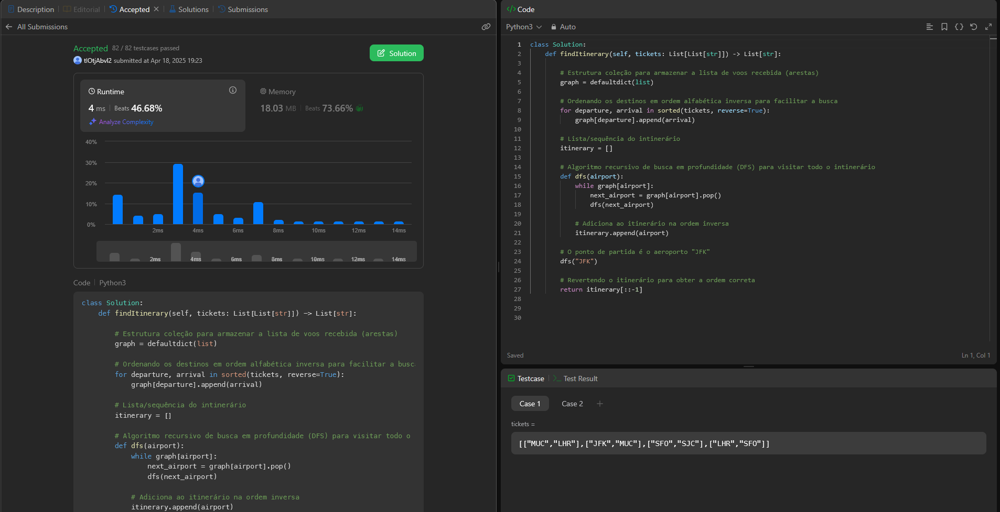

# 332. Reconstruct Itinerary

O arquivo [LC332.py](./LC332.py) apresenta a resolução do exercício número 1557 sobre grafos da plataforma LeetCode.

A resolução foi aceita pela plataforma, conforme a **Figura 1** abaixo:

<center>



**Figura 1** - Resolução da questão 332.

</center>


## Explicação da solução
1. Cria-se uma estrutura de dicionário para armazenar a lista de voos recebida.  ```graph = defaultdict(list)```

2. Ordena-se a lista de voos (tickets) recebida em ordem alfabética para facilitar. E armazena-se a lista recebida no dicionário criado, em que a chave é o aeroporto de origem e os valores são os destinos. ```graph[departure].append(arrival)```
 
3. Cria-se uma lista para sequeência do itinerário.  ```itinerary = []```

4. Defini-se uma função recursiva ```dfs()``` que implemta o algoritmo DFS de busca em profundidades para visitar todos os tickets (arestas). ```def dfs(airport):```
   Dentro da função também se adiciona os aeroportos ao itinerário em ordem inversa.

5. Chama-se a função com o parâmetro inicial ```"JFK"```, conforme solicitado pela questão.

6. E por último, retorna-se a lista de intinerários na ordem correta.  ```itinerary[::-1]```
