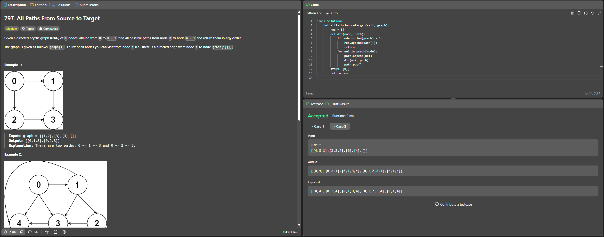

# 797. All Paths From Source to Target

O arquivo [LC797.py](./LC797.py) apresenta a resolução do exercício número 797 sobre grafos da plataforma LeetCode.

A resolução foi aceita pela plataforma, conforme a **Figura 1** abaixo:

**Figura 1** - Resolução da questão 797.

## Explicação da solução

1. O parâmetro "graph" é uma lista de adjacência, onde graph[i] contém os vizinhos (nós de destino) que o nó i alcança;

2. A lista final de caminhos encontrados é representada por "res", sendo cada caminho uma lista de nós no padrão das saídas esperadas pela plataforma. Ex: [0, 1, 3];

3. Define uma função auxiliar dfs que recebe o nó atual que está sendo visitado e o caminho que já foi percorrido até esse nó;

4. Se o nó atual for o último ou o destino, significa que um caminho completo foi encontrado. O algoritmo adiciona uma cópia de "path" em "res" (usa "path[:]" para evitar problemas com referências);

5. Para cada vizinho (neighbor) "nei" do nó atual, adiciona "nei" ao caminho atual e chama de forma recursiva DFS a partir do vizinho. Depois que a DFS volta (retorna), remove o último nó do caminho com path.pop() — isso é o backtracking;

**Saída:** Lista com todos os caminhos completos encontrados de 0 até n - 1.